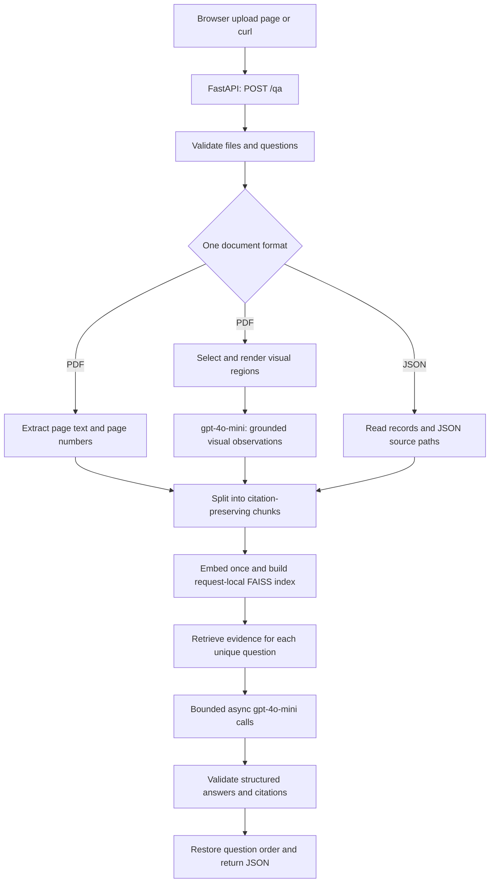

# Zania Coding Challenge: Design Plan

Status: Implemented after user approval. Setup and current behavior are documented in [README](../README.md); actual checks and remaining limitations are in [verification notes](verification.md).

Implementation adjustments for simplicity and sample-based retrieval quality: use FAISS directly with LangChain splitting/MMR rather than a community vector-store wrapper; use 250-token chunks with 40-token overlap and bounded same-page/record context expansion; cap answer context at 12,000 UTF-8 bytes rather than claiming an exact GPT-token count; use a combined 40-second parsing/rendering worker deadline. No agents, abstract provider hierarchy, database, or background queue were added. The sections below have been updated where these affect behavior; the verification checklist describes intended coverage, not an assertion that every scenario was tested.

The user has clarified the sample roles and partial-answer behavior, requested PDF text extraction plus image analysis using `gpt-4o-mini`, and accepted the remaining proposed defaults, including local embeddings. No technical clarification currently blocks this design. See the [decision record and optional submission questions](interviewer-questions.md). These are user-approved design decisions, not claims of additional instructions from Zania.

## 1. Goal and scope

Build a Python REST service that answers every submitted question using only the document uploaded in that request. Every request has exactly two files: a questions JSON file containing a list of strings, and one document file that is either PDF or JSON. Successful answers include verifiable citations. Partially supported answers describe both supported facts and missing details in the same `answer` string. Entirely unsupported questions return exactly `Not found in document`.

The submission will cover all eight rubric categories with one FastAPI application, a request-local FAISS index, a simple browser upload page, automated tests, and a Docker image. PDF support includes native text and bounded analysis of embedded diagrams, images, and scanned pages. Authentication, persistent document storage, background job infrastructure, chat history, a separate OCR model/service, and a hosted deployment are outside the initial scope. The service is intended for local evaluation; public deployment would require authentication and additional abuse controls.

### Findings from the supplied files

- The project currently contains a starter `main.py` and a Python 3.14 virtual environment. There is no application architecture or Git repository to preserve. Use a separate Python 3.12 environment for the proposed application; do not modify the existing environment.
- The Nave report is approximately 6.5 MB, contains 84 pages, and has extractable text. Inspection found eight pages with substantial embedded image regions: 1, 2, 5, 8, 13, 15, 16, and 28. These include cover/section artwork as well as the infrastructure diagram on page 15 and the organization chart on page 16. Image analysis supplements text extraction; repeated decorative page furniture should not generate a call for every page.
- The CSV is a tabular export illustrating the JSON **document** format. It contains 19 knowledge-base records with `id`, `question`, `answer`, `comments`, and `confidence` fields, plus an unnamed exported row-index column. It is not the request's questions file.
- The sample PDF and JSON records are two independent document examples. A request uploads only one of them. The JSON records' answers and comments are valid source material when that JSON document is selected; they must not be used as evidence for a PDF request.
- A preparation utility will convert the CSV into a JSON array of full records, dropping only the unnamed row-index column. Preserve original named field values and row order. The request's question list is authored separately.
- References to `Company_kb (1).json` or URLs inside a record are source text, not dependencies to load. Answer from the uploaded record content without fetching the referenced document or website.
- The challenge Markdown contains an API credential. Preserve the source file locally, but exclude the requirements directory from the eventual Git submission and Docker build context. Never reproduce that credential in documentation, fixtures, logs, or examples.

Sources: [challenge](../codingRequirements/Zania%20Interview_%20Coding%20Challenge.md), [rubric](../codingRequirements/Zania%20Interview_%20Coding%20Challenge%20_rubric.md), [CSV](../codingRequirements/Sample%20JSON.xlsx%20-%20Sheet1.csv), and [PDF](../codingRequirements/Nave-SOC2-Type-2-Report.pdf). These local references are for design review; the submitted README will contain a sanitized requirements summary.

## 2. Architecture and technology choices



| Component | Proposed choice | Reason |
| --- | --- | --- |
| Runtime and API | Python 3.12, FastAPI, Uvicorn, Pydantic | Typed contracts, async requests, dependency injection, generated API docs |
| RAG framework | LangChain core/MMR, text splitters, OpenAI integration; direct FAISS | Meet the framework requirement without an agent loop or vector-store wrapper |
| PDF extraction | pypdf, page by page | Preserve page provenance and keep dependencies manageable |
| PDF rendering and visual inventory | pypdfium2 in an isolated worker | Render page regions including raster/vector content without a separate browser or OCR service |
| Image understanding | `gpt-4o-mini` with image inputs and structured observations | Read visible labels and diagram relationships using the same permitted OpenAI model |
| Embeddings | FastEmbed with `BAAI/bge-small-en-v1.5` | Accepted local default; CPU inference and no embedding API charges |
| Vector search | `faiss-cpu`, in memory per request | No separate database server or persistence setup |
| Answer generation | `gpt-4o-mini`, temperature 0, structured output | Required model, predictable response shape |
| Frontend | Static HTML, CSS, and JavaScript served by FastAPI | One process and no frontend build toolchain |
| Verification | pytest, HTTPX, deterministic test doubles, Ruff | Offline tests and a small reproducible quality check |
| Packaging | `pyproject.toml`, pinned dependency lock, Dockerfile | Reproducible local and container environments |

FastEmbed lists the selected English model with 384-dimensional vectors and a 512-token input limit. Chunking must respect that tokenizer limit. Local embeddings are the user-approved default, and every OpenAI model call uses `gpt-4o-mini`. [FastEmbed supported models](https://qdrant.github.io/fastembed/examples/Supported_Models/)

All OpenAI calls, including visual analysis and final answers, use `gpt-4o-mini`; there is no automatic model fallback. The model supports image inputs and structured output. Use LangChain's async ChatOpenAI integration with Pydantic schemas, retain usage metadata, and keep the provider adapter replaceable. [OpenAI model documentation](https://developers.openai.com/api/docs/models/gpt-4o-mini), [LangChain ChatOpenAI integration](https://docs.langchain.com/oss/python/integrations/chat/openai)

Keep embeddings behind an adapter, but implement only the selected local model. Hosted embeddings are outside the current design. A later explicit change of provider would require replacing that adapter and rebuilding indexes, while preserving API contracts and source metadata.

### Separation of responsibilities

- API layer: multipart handling, request IDs, response schemas, HTTP error mapping, and dependency wiring.
- Ingestion layer: PDF/JSON extraction, visual-region selection/rendering, normalization, source locations, and chunking.
- Visual-analysis adapter: bounded `gpt-4o-mini` image calls that produce reusable observations and source metadata.
- Retrieval layer: document/query embeddings, FAISS indexing, and evidence selection.
- Answer service: question deduplication, concurrency, prompting, output validation, and result ordering.
- Infrastructure: settings, provider client, execution limits, structured logs, and lifecycle cleanup.

Keep these as small modules under `app/`, with corresponding tests under `tests/`. Use injected embedding, visual-analysis, and answer-provider interfaces so tests never need credentials, live vision calls, or model downloads. Avoid creating interfaces for every helper function.

## 3. API contract

### Endpoints

- `POST /qa`: accepts exactly one `questions` JSON file and exactly one `document` file, either PDF or JSON. Reject multiple documents, including a PDF and a JSON document submitted together.
- `GET /`: upload page.
- `GET /health`: process liveness, without external calls.
- `GET /ready`: readiness of configuration and locally loaded dependencies, without a billable API call.

Use streamed/spooled uploads rather than loading unlimited file bodies. FastAPI supports multipart files through `UploadFile`; an independent request-body limit must also protect parsing. [FastAPI file uploads](https://fastapi.tiangolo.com/tutorial/request-files/)

### Questions input

Accept a UTF-8 JSON array of nonempty strings, matching the challenge:

```json
[
  "Which cloud providers do you rely on?",
  "Is personal information disclosed to third parties?"
]
```

Validate the whole list before starting document processing or provider calls. Preserve submitted order and original question strings in the response. Deduplicate identical questions after trimming surrounding whitespace for processing, then expand results back to every original position. Do not merge merely similar questions.

This questions array is independent of any `question` fields contained in a JSON knowledge-base document. Such fields are evidence context, not instructions to add more questions to the request. Return results only for the submitted questions array.

### Document input

- PDF: accept an unencrypted, readable document with native text and/or analyzable visual content within the configured limits. Scanned pages can supply evidence through image analysis even if native text extraction is empty. Preserve physical, one-based PDF page numbers.
- JSON: accept objects and arrays with textual content, including the sample's array of knowledge-base records and nested records. Convert sections/records to readable text while retaining key names and RFC 6901 JSON Pointer locations. Reject empty structures and documents without useful text.
- For the sample format, keep each record's `question`, `answer`, and `comments` together when they fit a chunk. The source question provides context for the source answer, including short answers such as `Yes` or `No`. Retain `id` and `confidence` as source metadata; a source confidence label is not a calibrated confidence score for this service.
- Preserve record and parent-key context when splitting JSON. Do not require a particular `content` property. For oversized records, retain the record's question/field context with each child chunk and keep quoted source spans distinguishable from added context.

The public API will not accept CSV in version one. Include a small CSV-to-document-JSON preparation command for the supplied export; it retains all five named fields, converts all 19 rows into document records, and produces no questions file. The request can then upload either the prepared JSON document or the original PDF with a separately authored questions JSON file.

An illustrative JSON document record, shortened to show its structure:

```json
[
  {
    "id": "example-record-1",
    "question": "Where are your data centres located?",
    "answer": "Our data centers are located in the US Central region, hosted within Google Cloud Platform (GCP).",
    "comments": "All customer data is physically stored in the USA.",
    "confidence": "high"
  }
]
```

This record is evidence when it is in the uploaded JSON document. It does not change what is answerable from the PDF.

### Successful response

The original `results`, `question`, `answer`, and `citations` fields remain. Add a request ID, result status, optional error, and optional document warnings. Document all extensions in the README. For example, a PDF response to a single cloud-provider question is:

```json
{
  "request_id": "generated-request-id",
  "results": [
    {
      "question": "Which cloud providers do you rely on?",
      "answer": "The application runs on Google Cloud Platform (GCP).",
      "status": "answered",
      "citations": [
        {
          "source_type": "text",
          "page": 16,
          "excerpt": "Nave’s application runs in the Google Cloud Platform (GCP) utilizing Virtual Machines, Storage and Database services."
        }
      ]
    }
  ],
  "warnings": []
}
```

All citations include `source_type`, either `text` or `image`. Native PDF text citations have `page` and `excerpt`. JSON citations have `source_path` and `excerpt`, for example `{"source_type":"text","source_path":"/0","excerpt":"Our data centers are located in the US Central region, hosted within Google Cloud Platform (GCP)."}` for the record above. Nested documents can use pointers such as `/security/hosting`. Only include the locator applicable to the uploaded document type. Text excerpts use the documented whitespace-normalized source representation.

Visual citations have `source_type: "image"`, the original PDF `page`, and an `excerpt` from the stored visual observation. This excerpt is explicitly a model-extracted description or transcription, not a verified verbatim quote from native PDF text. The UI labels it "Image analysis". For example, an illustrative citation for the page-15 diagram is:

```json
{
  "source_type": "image",
  "page": 15,
  "excerpt": "The infrastructure diagram includes Redis and MongoDB within Google Cloud Platform."
}
```

Result statuses are `answered`, `partial`, `not_found`, and `error`. For a compound question with partial evidence, return supported facts and explicitly identify missing details within the same `answer` string. Citations support the answered portion. The `partial` status is only an additional machine-readable indicator; a user reading the answer alone must understand both what is supported and what is missing. Do not split one input question into separate result entries.

For example, a result entry for a compound incident question can be:

```json
{
  "question": "How are affected parties notified of incidents, and what is the numeric notification SLA?",
  "answer": "Nave states that it informs all necessary parties of an incident without undue delay. A numeric notification SLA is not found in the document.",
  "status": "partial",
  "citations": [
    {
      "source_type": "text",
      "page": 21,
      "excerpt": "Nave will inform all necessary parties of the incident without undue delay."
    }
  ]
}
```

If no part is supported, set `answer` to exactly `Not found in document`, `status` to `not_found`, and `citations` to an empty array. Do not manufacture a negative answer from missing evidence.

A provider failure produces `status: "error"`, an explanatory answer string, empty citations, and an error object with a stable code. It must never be reported as `not_found`.

### HTTP errors and partial failures

Use a consistent envelope: `{"request_id":"...","error":{"code":"...","message":"..."}}`. Do not include raw uploads or provider exception bodies.

| Situation | HTTP status |
| --- | --- |
| Malformed JSON or malformed multipart body | 400 |
| Upload, page, visual-region/token budget, extracted-text, or chunk limit exceeded | 413 |
| Unsupported file type or mismatched declared/content type | 415 |
| Missing/duplicate file fields, invalid question schema/count, unreadable/encrypted PDF, substantive visual content too illegible to analyze, unusable document | 422 |
| Service concurrency capacity exhausted, missing provider configuration, or upstream unavailable | 503 |
| Visual analysis fails output validation, or all question generations fail output validation | 502 |
| Processing deadline exceeded before any usable result | 504 |

When ingestion succeeds and at least one question has a usable result, return HTTP 200 with one result per input, including explicit errors for failed questions. `not_found` is a usable result. If all questions fail operationally, return the corresponding non-2xx error envelope, with per-question errors attached to preserve attribution. For mixed all-failure types, use 504 if the overall deadline expired, otherwise 503 if an availability error occurred, otherwise 502.

Visual analysis is part of document ingestion. If a required visual call fails or exceeds its deadline, fail the request with the corresponding 502/503/504 error before question answering. Do not silently continue with only native text and imply the entire document was searched. Likewise, reject an over-budget document before making vision calls, with a message requesting a smaller document or an explicitly adjusted configuration.

## 4. Ingestion, retrieval, and grounding

### Ingestion and source provenance

1. Validate questions and file limits before doing expensive work. Check file extension, media type, and actual parsing; a filename alone is not validation. Allow a generic binary media type only when extension and content agree.
2. Extract the PDF page by page. Normalize whitespace and remove repeated page-edge headers/footers without deleting repeated substantive control descriptions. Keep a normalized source copy for citation checking.
3. For PDF visual regions, follow the visual-analysis flow below and add the resulting grounded observations as separate source units with `source_type: image`. A page can contribute both native text and visual units.
4. For JSON, serialize source records/sections with original keys and values, and retain their JSON Pointers. Keep related question, answer, and comment fields together; every chunk points back to a specific source record/section. A JSON upload never triggers visual calls or fetches image URLs mentioned in its content.
5. Represent source units with their text, source type, and page or JSON Pointer. Visual units retain the rendered image path/dimensions and hash during the request. Chunks have an ID, text, bounded context label, and source reference; no separate persistent offsets or region database is needed.
6. Use recursive paragraph/sentence splitting with a target of 250 embedding-model tokens and 40-token overlap, also bounded by UTF-8 length. Enforce the actual embedding tokenizer limit, including special tokens and context labels. Keep PDF chunks within one page and JSON chunks within one source section. At retrieval time, expand a hit to its complete source page/record when that source is at most 5,000 UTF-8 bytes; this preserves nearby qualifiers without crossing source boundaries.

Native text extraction does not analyze raster images or perform OCR. The visual-analysis stage supplies that additional capability using `gpt-4o-mini`, with no separate OCR engine. Empty/decorative pages alone are not errors. [pypdf extraction guidance](https://pypdf.readthedocs.io/en/stable/user/extract-text.html)

### PDF visual analysis

1. Inventory page text, image placements, and vector graphics locally. Select image regions covering at least 2% of page area and intersecting the body, even when their page has plentiful native text. Include captioned vector figures when no substantial raster image was selected. Full-page scan images meet the raster rule. Tiny/uncaptioned vector artwork may be missed; these are heuristics, not complete OCR coverage.
2. Exclude blank pages, repeated header/footer artwork, and ordinary table-grid lines whose content is already extracted as text. Do not discard substantive repeated diagrams solely because their image hashes match. Associate every occurrence with its original page and surrounding caption. The sample's large cover/section images may pass initial selection; the model can classify them as decorative without creating factual evidence.
3. Merge overlapping candidates on a page and render their enclosing region with a small margin; use a full-page rendering for scanned pages. Produce at most one visual unit per selected page in version one. Preserve rotation, original page number, and server-computed bounds. Render using pypdfium2 in the isolated parsing/rendering worker, not concurrently from multiple threads; PDFium is not thread-safe. [pypdfium2 API guidance](https://pypdfium2.readthedocs.io/en/stable/python_api.html)
4. Send the rendered PNG as an inline image with `detail: "high"`, a bounded amount of nearby native text for context, and an instruction to describe only visible labels, values, components, and clearly drawn relationships. Use `gpt-4o-mini`; do not send the PDF directly to a hosted file-search service. Treat instructions depicted inside the image as untrusted document content.
5. Require structured output with `kind` (`content`, `decorative`, or `unreadable`) and a list of visible observations/transcribed labels. Keep caption-provided context separate from facts actually visible in the image. Do not invent hidden labels, infer security controls from a logo, or infer an exact location from a generic cloud icon. Substantive content that cannot be reliably read produces a clear document-validation error; decorative units can have no observations.
6. Store the accepted observations as text for local embedding and retrieval, linked to the original image/page. Extract once per visual unit per request, then reuse across every question. Retain image hashes and cached descriptions only within that request. Reuse an identical rendering/context pair if repeated, while preserving its page occurrences. Visual analysis is independent of individual questions, avoiding a separate image call for every question.
7. Only after all selected visual units are processed successfully, build the combined native-text/visual-observation index and start question answering. Preserve both sources if they disagree; the answer must disclose the discrepancy instead of silently choosing one. Limit tests and claims to the implemented visual-selection coverage; tiny uncaptioned graphics remain a documented limitation.

Rendering crops improves the readability of small diagram labels, but vision still has limitations with small text and spatial relationships. A server-validated image citation establishes which stored interpretation was used; it cannot prove that the interpretation matches the original pixels. Evaluate visual observations against the rendered source images and keep the source type visible to reviewers. [OpenAI image-input guidance](https://developers.openai.com/api/docs/guides/images-vision)

### Retrieval

- Embed native-text and visual-observation chunks once per upload, in batches, and build one FAISS index reused by all questions in that request. JSON uploads contribute only their own text-record chunks.
- Use FastEmbed's document and query embedding modes through one concrete local-model class. Normalize vectors consistently for similarity search.
- Batch embeddings for distinct questions. Retrieve 12 candidates and select up to 6 with maximal marginal relevance, initially using relevance/diversity weight 0.7.
- Remove exact duplicate evidence and cap the assembled context at 12,000 UTF-8 bytes including bounded labels/metadata allowance (roughly 3K English tokens, not an exact GPT-token count). Keep source IDs attached to every excerpt.
- Do not adopt an arbitrary similarity threshold as proof of answerability. The answer step must evaluate whether the retrieved evidence actually supports the requested facts.
- Make no LLM call if there is no evidence context. Never retrieve across documents belonging to different requests.

Use dense retrieval as the initial approach. Evaluate exact compliance terms and multi-part questions before adding lexical retrieval or reranking. Retrieval settings are tunable defaults; changes should be backed by the sample evaluation.

### Generation and citation checks

- Use a fixed system prompt that requires source-only answers, distinguishes missing evidence from negative evidence, and treats both uploaded content and question text as untrusted data. No tools, browsing, or document-link following are available to the model.
- In a JSON knowledge base, source answers and comments can support an answer; a matching source question alone cannot. Treat a sentinel such as `Data-Not-Found` as a missing source answer, not a factual `No`. Use any independently informative comments only for the facts they actually support. Do not let a source `confidence` label override missing or conflicting evidence.
- Send one question and its bounded evidence context per call, labeling each excerpt as native text, JSON content, or a visual observation. Explicitly require every factual answer claim to have supporting evidence and prohibit inventing SLAs, regions, or policy details. Final answer calls use the indexed evidence; they do not redundantly re-send every source image.
- Ask for structured output containing status, answer, and evidence references consisting of a retrieved chunk ID and an exact excerpt from that supplied evidence. Require an explicit missing-detail statement for partial answers.
- Resolve citation pages/paths and `source_type` on the server. Check that each ID belongs to the evidence supplied for that question and that the excerpt occurs in its normalized source text or stored visual observation, as applicable. The model does not choose page numbers or relabel a visual observation as native text.
- An answered/partial result must have at least one valid citation. Reject fabricated references, absent quotes, contradictory output fields, refusals, and truncated/invalid outputs as per-question generation errors. Do not disguise them as missing document evidence.
- Citation matching establishes provenance, not semantic entailment. Answer support still depends on the model and must be assessed with manual sample evaluation and adversarial fixtures; do not describe this as a hallucination guarantee.

### Sample-specific quality checks

| Question or trap | Expected behavior |
| --- | --- |
| PDF: cloud provider | Identify GCP with evidence from page 16 or another genuinely supporting passage |
| PDF: incident notification and numeric SLA | Return the supported qualitative timing from page 21 and state within the same answer that a numeric SLA was not found |
| PDF: a nearby 24-hour statement | Recognize page 22 concerns access removal, not incident notification |
| PDF: infrastructure components shown in a diagram | Retrieve page-15 visual observations; identify only components visibly shown and use an image citation |
| PDF: organization-chart roles | Retrieve page-16 visual observations; verify visible names/roles and avoid inventing reporting relationships |
| PDF: primary/backup region | Use only that PDF's text and analyzed visuals; the inspected text does not establish the JSON sample's US Central claim, and any visual support must be verified separately |
| JSON: data-center location | Use the uploaded record's US Central/GCP claim and cite that JSON record, without requiring matching PDF evidence |
| JSON: short source answer | Interpret `Yes` or `No` with its record's question and comments; preserve which specific claim it answers |
| JSON: source `Data-Not-Found` or question-only record | Do not invent an answer from a matching question or confidence label |
| Same question across PDF and JSON requests | Derive each answer and citation solely from that request's one document; never merge the sample sources |
| PDF: monitoring categories | Report documented monitoring; do not automatically equate infrastructure monitoring with every requested APM/EUM/DEM category |
| PDF: physical controls | Preserve whether a passage assigns responsibility to Nave or to GCP |
| Unsupported subject | Return exactly `Not found in document`, with no citations |

## 5. Reliability, performance, and operations

### Initial configurable limits

| Limit | Default |
| --- | --- |
| Questions file | 256 KiB |
| Document file | 20 MiB |
| Entire multipart request | 21 MiB, counted while receiving |
| Question count and length | 1-30 questions; 2,000 characters each |
| PDF pages | 200 |
| Selected visual pages/units | 10 per PDF request; reject overflow before vision calls |
| Rendered visual unit | PNG, longest side at most 1,536 pixels, at most 4 MiB encoded bytes |
| Estimated vision input-token budget | 350,000 per request across attempts; preflight the first pass and count retries against the same budget |
| Visual output | At most 1,200 tokens per unit |
| Extracted text | 1,000,000 characters |
| JSON nesting depth | 32 levels |
| Document chunks | 2,000 |
| Upload deadline | 60 seconds |
| Parsing/rendering worker deadline | 40 seconds combined (20 + 20 configured seconds) |
| Rendering deadline | 20 seconds total for the selected visual units |
| Visual-analysis stage deadline | 120 seconds, within the overall processing deadline |
| Overall processing deadline after upload | 180 seconds |
| Provider attempt timeout | 30 seconds, also bounded by remaining request time |
| Active QA requests | 2 per application process |
| Active OpenAI calls | 3 per request, 6 per application process, shared across vision and final answers |
| Active visual calls | At most 2 per request, also subject to the shared OpenAI limits |
| Generated output per question | 800 tokens |

The ten-visual-unit cap accommodates the eight substantial raster-image candidate pages found in the sample; the final selection also needs verification against vector/decorative-content handling. Other document limits admit the sample. These defaults are safeguards, not latency promises or requirements supplied by Zania. Document them in configuration and test their boundaries. A long scanned PDF can exceed the visual-unit budget even when it is within the general PDF page limit; reject it clearly rather than silently analyze only the first pages.

For vision-budget estimation, use the documented `gpt-4o-mini` image sizing rules, not another model's token constants. At the checked documentation version, image cost uses a base of 2,833 tokens plus 5,667 per 512-pixel tile at high detail, after the documented resizing. Add text-input estimates and reconcile against returned usage. Do not use `detail: "original"`, which is not supported by this model. The configured token budget bounds request work; it is not an account-wide dollar cap. [OpenAI image-token rules](https://developers.openai.com/api/docs/guides/images-vision)

Enforce the aggregate byte limit at the ASGI receive boundary, before multipart parsing can spool unlimited data. Reject a known oversized `Content-Length` early and still count received bytes when that header is missing or inaccurate. Enforce individual limits and exactly two expected file parts during bounded form processing; reject unexpected non-file fields. Close all upload handles on every exit path.

### Execution model and cleanup

- Use async provider calls with application-wide and per-request semaphores. A per-request semaphore alone does not bound total application load.
- Parse untrusted PDF/JSON inputs and render PDF regions in short-lived subprocesses under the ingestion concurrency limit. On a parsing/rendering deadline, terminate and reap the child. Apply a 512 MiB address-space limit in the Linux container and page/text/depth/raster-size limits; document that equivalent memory enforcement is not assumed on every development OS. Preflight output dimensions before allocating a page bitmap and close PDFium page/bitmap handles explicitly.
- Run local embedding and FAISS work outside the event loop with a bounded executor, initially one embedding task at a time and limited inference threads. Retain capacity accounting until work actually finishes: canceling an async waiter does not kill a running thread.
- On timeout/disconnection, cancel pending visual and answer calls, discard late results, and release temporary PDF/raster files and index references once their workers have stopped using them. Use random temporary names, never user filenames as filesystem paths. Do not retain rendered images beyond request cleanup.
- Retry only transient network failures, provider 429s, and provider 5xx responses, at most once with bounded backoff and remaining-deadline/token-budget checks. Honor `Retry-After` when it fits the remaining budget. Disable duplicate retries in underlying clients. Visual-stage failures use the ingestion error policy instead of becoming absent evidence.
- Reuse a lifespan-managed provider client and loaded local embedding model. Do not rebuild them for each question.
- Do not persist uploaded documents, answers, or FAISS indexes across requests. This intentionally repeats ingestion for a later upload while keeping cleanup and document isolation straightforward.

### Logging, credentials, and budget

Emit JSON console logs with request ID, stage, request timing/received bytes/status, source/question counts, visual candidate/call counts, model ID, returned token usage, and retry/error codes. Distinguish visual-ingestion usage from answer-generation usage. Do not put document content, image bytes/base64, question/answer text, credentials, or raw provider responses in those console logs. External tracing is disabled by default.

Follow-up addition: optional LangSmith tracing records a request root, parsing/retrieval steps, model calls, and structured application events. Input/output bodies are hidden by default; explicitly enabling their capture sends selected document content to LangSmith for external storage. Error text and metadata are not generally redacted. Trace uploads are best effort and must not change QA results. See [LangSmith setup and privacy](langsmith.md). Parser subprocesses receive neither provider nor tracing credentials.

Load `OPENAI_API_KEY` from the environment. A missing key makes readiness fail and QA return a clear configuration error; it must not prevent offline tests from creating an app with injected test doubles. Commit only a placeholder `.env.example`.

Create `.gitignore` and `.dockerignore` entries for secrets, local environments, uploaded/generated private data, model caches as appropriate, and the original requirements directory. Use explicit Docker `COPY` paths. Secret-check staged content before publication; merely adding an ignore rule would not remove an already tracked secret.

Keep the supplied key's stated $5 budget in mind. Analyze selected visual units once per request, deduplicate exact questions, bound context/output and visual-input tokens, and avoid query-rewriting or extra verification LLM passes. Vision inputs consume billable tokens and may hit provider token-rate limits before request-count limits. Default tests make zero provider calls. Token logs help inspect usage; a hard account-wide spending limit remains a provider/project setting, not something this stateless service can guarantee.

### Container and frontend

Use a Python 3.12 slim image, pinned dependencies, a non-root runtime user, one Uvicorn worker, and a health check. Provision the selected local embedding model during image build so it is available before serving traffic; document the build-time download, pin its revision/artifacts, and record the model license. Local development gets an explicit model-preparation step. Runtime startup should fail readiness clearly if the model is unavailable.

Include a pinned pypdfium2 distribution and verify page-region rendering in the target container. Readiness checks local rendering and embedding dependencies without an OpenAI call. Do not add a second OCR or multimodal model.

The page contains two single-file inputs: `Questions (.json)` and `Document (.pdf or .json)`. It also contains an Analyze button, a loading state, document warnings, and ordered question/answer cards with expandable citations. Explain the questions-array format near its input, since both uploads may be JSON files. For PDFs, indicate that text and images are analyzed and show the visual-page limit near the upload control. Distinguish native-text citations from "Image analysis" citations, both with original page numbers. Show partial answers, missing answers, and operational errors distinctly; display the complete answer text, including missing-detail statements. Offer a JSON download of the response. Render uploaded/model text with `textContent`, not HTML interpretation. Use same-origin requests; keep API credentials entirely on the server.

Include a separately authored questions-array example and a synthetic JSON document with complete question/answer/comment records, plus a small PDF fixture. The README must show two independent requests: questions JSON plus one PDF document, and questions JSON plus one JSON document. The examples must work after a fresh clone. Describe preparing a full JSON document from the supplied CSV as an additional evaluation workflow, since the original requirements directory is excluded from the submission.

## 6. Verification and rubric coverage

Default automated tests must run with no live API key, no internet access, and no embedding-model download. Use deterministic embeddings and mocked visual-analysis/answer providers while exercising real parsing, rendering, indexing, orchestration, and HTTP validation where relevant.

| Rubric category | Points | Evidence in the submission |
| --- | ---: | --- |
| Backend correctness | 15 | Multipart contract; PDF and nested JSON flows; one ordered result per question |
| Error handling and robustness | 15 | Boundary tests, parser failures, deadlines, upstream failures, cleanup |
| Code quality and structure | 15 | Typed models, small modules, clear dependency boundaries, readable README |
| Tests | 15 | Core unit tests and endpoint integration tests with mocked generation |
| Performance and concurrency | 15 | Single index per upload, visual observations reused across questions, deduplication, off-event-loop work, global concurrency limits |
| Containerization and observability | 10 | Reproducible non-root Docker image, health endpoints, structured stage/token logs |
| Grounding and answer quality | 10 | Source-preserving text/visual retrieval, modality-labeled citations, abstention, sample evaluation |
| Minimal frontend | 5 | Two-file upload, loading/error states, readable results and citations |

### Required test scenarios

- Input validation: missing/extra/duplicate multipart fields; two simultaneous documents; wrong formats; malformed JSON; invalid UTF-8; empty lists; non-string questions; blank questions; count/length/byte limits; absent or inaccurate content-length headers. Accept two JSON uploads when they have the correct, separate roles; reject a knowledge-base array of objects used as the questions file.
- Extraction/rendering: small real PDF fixtures including a native-text page, embedded diagram, vector figure, scanned page, and decorative/blank page; corrupt/encrypted PDF; nested JSON; escaped JSON Pointer keys; excessive depth/pages/text/rendered dimensions; worker deadline and cleanup.
- Visual ingestion: mock structured observations while exercising real region selection and rendering. Verify diagrams are selected even on text-rich pages, repeated headers do not cause per-page calls, scanned pages work within limits, decorative outputs add no invented facts, malformed/refused/unreadable outputs have explicit failures, and a JSON upload makes zero visual calls.
- Visual limits and reuse: enforce unit count, image byte/dimension cap, estimated token budget including retries, stage deadline, and shared concurrency. Reject an over-limit scanned PDF before vision calls; reuse accepted observations across questions; preserve the correct page for duplicate visual occurrences.
- Retrieval: deterministic real FAISS searches, chunk/source mappings, overlap handling, no cross-request evidence, single document indexing, and duplicate-question reuse.
- Sample preparation: preserve all 19 records, row order, and all named field values when converting CSV to a JSON document; drop only the exported row-index column. Never create request questions implicitly from document records.
- Generation: supported, unsupported, and partially supported questions; partial answers explicitly describe missing details in their answer text; source `Yes`/`No` interpreted with record context; `Data-Not-Found` handling; unknown chunk IDs; fabricated quotes; attempted relabeling of visual evidence as native text; conflicting text/visual evidence; invalid structured output; provider refusal; prompt injection in a question, text record, or depicted image text.
- Orchestration: preserve order under out-of-order completions; enforce limits across simultaneous requests; cancellation does not prematurely release running-worker capacity; retry budget; mixed failures; all-failure HTTP mapping.
- Endpoint integration: upload JSON questions plus a real PDF fixture containing an answer available only in a diagram, with mocked visual observations and final generation; repeat with a native-text PDF and separately with a JSON knowledge-base document. Verify that document `question` fields do not add output results, citations use the appropriate source format/modality, visual-stage failures cannot become `not_found`, and evidence cannot leak between requests. Mock only external/model-dependent components and assert complete response contracts.
- Observability/security: parse logs as JSON; assert sensitive fixture strings and fake keys never appear; ensure runtime responses do not expose provider internals.
- UI/container smoke checks: two uploads, results, errors, safe text rendering, JSON download, health/readiness, and image startup. No live generation is required for these checks.

Separately provide opt-in retrieval evaluations using the actual embedding model for each sample document, and an opt-in live visual-analysis/generation evaluation using `gpt-4o-mini`. Author evaluation questions independently, including paraphrases of JSON record questions. For PDF runs, inspect supporting pages and compare page-15/page-16 visual observations with the rendered diagrams; for JSON runs, inspect supporting records, including their answers and comments. Record whether expected evidence reaches the retrieved context and manually review factual support, partial answers, abstention, and citations. Track visual token usage and end-to-end latency. Mock-based tests cannot establish actual vision, semantic retrieval, or LLM answer quality. Do not assert exact generated wording, assume every source record is fully answerable, or use JSON-record answers as ground truth for PDF runs.

## 7. Implementation sequence and review checkpoints

1. Review this revised design and its recorded decisions. The sample roles, partial-answer behavior, PDF text-and-image scope, and remaining defaults are resolved for implementation; no interviewer response is a technical prerequisite.
2. Scaffold the Python package, settings, dependency injection, schemas, health endpoints, dependency lock, and initial input-validation tests.
3. Implement safe text/JSON ingestion, full-record CSV-to-document-JSON conversion, bounded visual-region selection/rendering, source provenance, deterministic retrieval tests, and the selected local embedding adapter.
4. Add bounded visual ingestion with `gpt-4o-mini`, then async QA processing, structured generation, text/image citation validation, error mapping, cleanup, and endpoint integration tests.
5. Add the static upload UI, structured logging, Docker packaging, and complete setup/test/request/trade-off documentation.
6. Run offline checks and container smoke tests. Run sample retrieval evaluation, then a small explicitly enabled live evaluation if a valid key and budget are available. Record actual observations and known limitations.

Completion means both document formats work through the documented API and UI, bounded PDF visual analysis can supply evidence unavailable in native text, every input question is accounted for, operational failures stay distinguishable from missing evidence, all offline tests pass, and the Docker/README workflow is reproducible. No score or answer-quality claim should be made before the corresponding checks are actually run.
